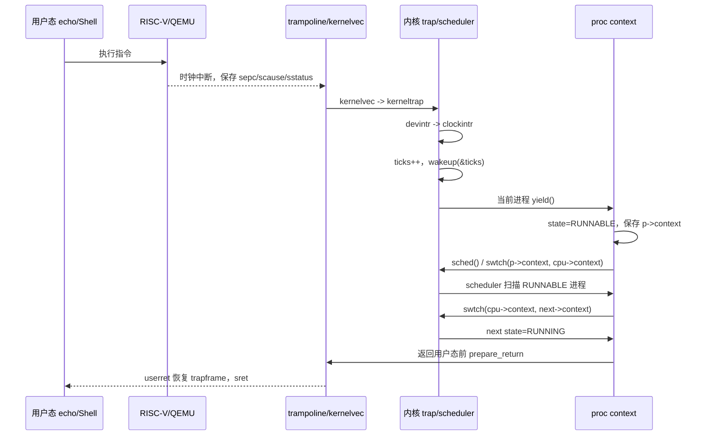

# Lab0：时钟中断与上下文切换时序图（草稿）

```mermaid
sequenceDiagram
  participant U as 用户态 echo/Shell
  participant HW as RISC-V/QEMU
  participant TV as trampoline/kernelvec
  participant K as 内核 trap/scheduler
  participant P as proc context

  U->>HW: 执行指令
  HW-->>TV: 时钟中断，保存 sepc/scause/sstatus
  TV->>K: kernelvec -> kerneltrap
  K->>K: devintr -> clockintr
  K->>K: ticks++，wakeup(&ticks)
  K->>P: 当前进程 yield()
  P->>P: state=RUNNABLE，保存 p->context
  P->>K: sched() / swtch(p->context, cpu->context)
  K->>P: scheduler 扫描 RUNNABLE 进程
  P->>K: swtch(cpu->context, next->context)
  K->>P: next state=RUNNING
  P->>TV: 返回用户态前 prepare_return
  TV-->>U: userret 恢复 trapframe，sret
```

状态不变式：进程调用 `sched()` 时必须持有自己的 `p->lock`、状态不能是 `RUNNING`，且中断关闭；调度器切换回来后，进程状态已由进程自身改为 `RUNNABLE`、`SLEEPING` 或 `ZOMBIE`。
